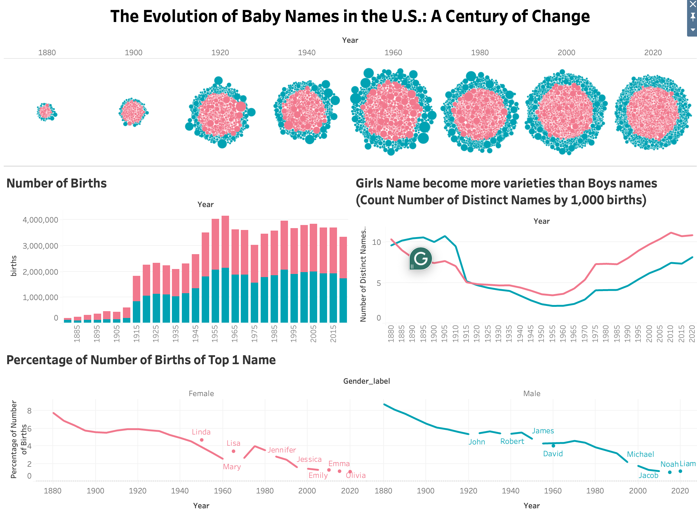

# The Evolution of Baby Names in the U.S.: A Century of Change
MACS 40700 1 Data Visualization 
Assignment 4
## Phornchanok (Paula) Tepkham
[Link to Tableau Dashboard](https://public.tableau.com/shared/J3MXGFDFS?:display_count=n&:origin=viz_share_link)

### What is the Story?
THow baby names in the United States have evolved from 1880 to 2023? I explores naming diversity, popularity trends, and birth frequency, providing insights into how societal and cultural influences have shaped parents' choices over time. The data highlights that the decline in the dominance of the most popular names, the rise in unique names, and the changes in birth rates across different decades. 

One of the most striking observations is that the most popular names in earlier years had a significantly higher percentage share of total births compared to today. For example, in the 1880s, a few names dominated, whereas today, names are more varied, reflecting a cultural shift towards individuality and uniqueness. Additionally, the birth rate data aligns with major historical events, such as the Baby Boom era (1945–1960) and the subsequent stabilization of birth rates in the late 20th and early 21st centuries.

### Why This Graphical Form?
The visualization consists of multiple graphical elements, each chosen to effectively convey different aspects of the data.

The bubble chart at the top visually represents the diversity of names over time. In earlier years, there were fewer names, resulting in large clustered bubbles. Over time, as naming diversity increased, the bubbles became more dispersed, showing that parents are choosing from a broader set of names. The gender color coding (pink for female names, blue for male names) makes it easy to see gender-related differences.

The stacked bar chart depicting total births by gender was chosen to highlight birth trends over time. The use of stacked bars allows for a clear breakdown of male and female births while showing how overall birth rates fluctuated. This chart effectively illustrates how historical events, economic conditions, and social changes have influenced birth trends.

The line chart tracking the number of distinct names highlights the increasing diversity in naming choices, particularly for female names, which have historically been more varied. This visualization effectively demonstrates that modern naming conventions have become much less traditional, with more parents opting for unique names.

Finally, the line chart showing the top-ranked name by gender provides an insightful look at how name popularity has changed over time. The declining dominance of top names indicates a significant cultural shift, as parents move away from widely used names and instead seek more distinctive options. For Girls, "Mary" dominated the late 1800s with over 8% of female births, but later names like "Linda," "Lisa," "Jennifer," "Jessica," "Emily," "Isabella," "Emma," and "Olivia" took over. The overall decline in the dominance of top names reflects increased variety in baby name choices. For Boys, "John" was the most common name in the early 20th century, later giving way to "Robert," "James," "David," "Michael," "Jacob," "Noah," and "Liam." Unlike female names, male names have remained more stable, with a slower decline in dominance.

### Role of Interactivity
Interactivity plays a crucial role in enhancing user engagement and making the data more accessible. Features such as hover tooltips provide additional details without cluttering the visualization. Filtering by gender allows viewers to focus on either male or female names, making comparisons easier. The ability to explore different time periods dynamically enhances the storytelling aspect, allowing users to see trends over specific decades.

These interactive elements make the visualization more functional and insightful, enabling users to customize their exploration of the data and discover meaningful patterns.

### How Does It Communicate Data Effectively?
This visualization is truthful, functional, beautiful, insightful, and enlightening in multiple ways. The data is presented accurately, with proper scaling and proportions ensuring that no trends are exaggerated or misrepresented. The graphical choices enhance readability, making the information easy to digest at a glance. The color scheme effectively distinguishes gender, and the layout is structured to guide the viewer through the story logically.

Beyond aesthetics, the visualization is deeply insightful, uncovering patterns that may not be immediately obvious. For example, the declining percentage of the most popular names suggests a shift in naming conventions, while the birth rate data contextualizes these trends within broader historical events. By combining historical context with data-driven insights, the visualization provides a compelling narrative about how and why naming practices have evolved.

